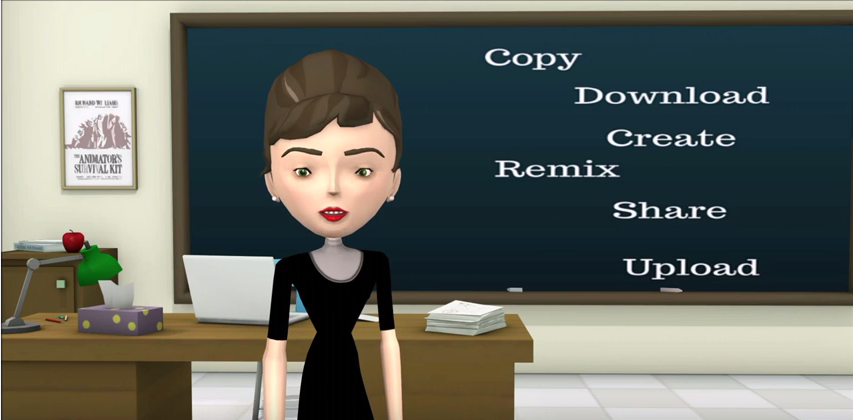

---

layout: case-example
header: ea-image
title: E-Assessment Example
category: ETL532
element: E-Assessment
weight: 3
mixer: 4
features: Assignment 1 - Digital Artefact
description: The individual creation of a digital artefact required students to be able to demonstrate an understanding of key concepts of digital citizenship and the social, political, ethical and technological issues affecting digital citizenship development. It also encouraged transliteracy skills and clear communication of ideas through the use of multimedia.
strategies:
  - "Creating Rich Media Artefacts"
taster-video: NkXU81zceuY
main-video: HKeyxsaqdXA
---

### Strategies Used

- **[Creating rich media artefacts]({{ site.baseurl }}/strategy/creating-rich-media-artefacts.html)** - Student development of technical and communication skills using multimedia and online tools.

### Motivation

The individual multimedia artefact is Part B of Assignment 1: ’Digital Citizenship Learning Module’. In small teams students collaborated on building an online learning module based on a digital citizenship concept. As part of this they selected a sub-topic for an individual digital artefact that needed to ‘fit in’ with the module content. The individual creation of a digital artefact required students to be able to demonstrate an understanding of key concepts of digital citizenship and the social, political, ethical and technological issues affecting digital citizenship development. It also encouraged transliteracy skills and clear communication of ideas through the use of multimedia.

The final artefact was meant to align with the group learning module project and be embedded into the team wiki interface. Students’ ideation and creativity afforded a successful artefact that showed evaluation of certain resources and ideas and brought together a definitive statement and set of information regarding the chosen topic.

### Video Explanation



### Implementation

**Part 1: Team module building and artefact sub-topic selection**

Students collaborated on the learning module content and chose a unique sub-topic to build their individual digital artefact.

**Part 2: Development of the digital artefact**

Once a topic was chosen students then explored a range of digital tools to find one they were comfortable using to create the digital artefact. The digital artefact could be any reliable Web 2.0 tool for audio, video or image/text production such as Voicethread, Smore, or Slideshare. This was a self-help process - with of course students connecting and collaborating and sharing ideas, resources, and support for tool skill development. It was encouraged, but not mandatory, that students explore a combination of tools e.g. Powtoons and YouTube, to create and deliver the final artefact.

{: .u-full-width}

**Part 3: Artefact completion, upload and embed**

It was a requirement that the artefact be uploaded (if not already online) and in a state where it had a unique URL and could be embedded (not just linked from) the wiki-based learning module.

**Part 4: Final outcomes for students**

This task provided for expression of ideas and communication of a message using online multimedia as well as exploration of tools that could be used to support learning and teaching beyond the assignment. Although some students found working with digital media challenging, all students gained confidence with online tools and the ability to create a communication piece that could be shared with others. Many students used their artefacts in conjunction with the learning module in their schools and learning environments to support both teacher and student understanding of digital citizenship.

### Words of advice for wider implementation

This activity/assignment is a communication task, not a digital tools task, and this is important to remember. It challenges students and those with a lower ability using digital technology need to be provided with satisfactory examples and suggestions for tools that will allow them to successfully meet the rubric requirements. It was made clear however that a typical PowerPoint response was not adequate to meet criteria for success. Students are assessed on their ability to ‘express ideas and communicate a message’ and ‘understand key digital citizenship concepts and issues affecting digital citizenship development’.
