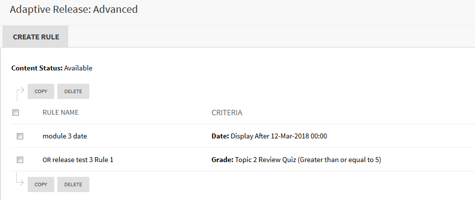

---

layout: strategy
title: "Adaptive Release "
category: strategy
tags: [Flexible & Adaptive Learning, ]
description: "Using rules to release content to students based on activity."
subjects: "FIN516"
subjectnames: "Corporate Finance"
label: LEF

---

### Overview

Adaptive release is the process of applying rules or criteria to the release of learning materials to students. This may be dependent on student achievement or dates. Fisher, Gardner, Brinthaupts & Raffo (2014) note that adaptive (conditional) release activities can help teachers to manage how students proceed through a course, provide flexible delivery of course content or scaffold efforts to support students.

Various rules can be created to support students in the management of their learning and engagement with the content these may be based on an action *e.g students have reviewed topic content, achievement eg must achieve 60% on a test, teacher determined eg content released on date*.

### Engagement

### In Practice

#### Subject

FIN516 Corporate Finance

#### Teaching Staff

Ruhina Karam

#### Motivation

Students in this subject were not completing the end of topic quizzes, formative, non graded tasks designed to provide practice and revision of skills. There is a strong correlation between those who do not complete the end of topic quizzes, and those who struggle with the assessable tests and exam. As each topic builds on previous knowledge, the non graded revision quizzes provide the opportunity for instant feedback to identify and correct misconceptions and improve future assessment performances.

#### Implementation

Content release in FIN516 utilised 2 adaptive rules. It was designed for release on both a score of the previous topic quiz (50%) and the date that the topic would normally be studied in the usual 14 week cycle (so no-one is disadvantaged). Students can accelerate through a topic and are in control of their learning and developing skill level.  The unlimited attempts allowed students the freedom to test their knowledge and return to the test during the session.  

{: .u-full-width
}

### Guide

Setting up for success

* Ensure you have a clear purpose for using adaptive release. Is adaptive release appropriate for your subject? Does it support your learning outcomes?
* Consider your content: adaptive release is most suited to subjects that have a linear progression in which new content builds upon previous content.  
* Consider your students skills: how capable are they to work with adaptive release of content and manage their own learning? Provide an appropriate level of guiding instruction to support them.

Preparing students for success
* Ensure students are aware of what you are doing and why.  It may be confusing to students if for example there is only one module.  Understanding why you have designed the release of content in this way also supports students engagement in the process.  
* Consider your learners, how much support will they need. If content is released for achievement what support do you have in place for students who are having difficulty.  
* Students also have commitments other than study, therefore how will the adaptive release rules cater for those who need to vary from the prescribed study schedule?

### Tools

Within Blackboard you can access two types of adaptive release:

* Basic adaptive release: allows the application of one rule to the content.
* Advanced adaptive release: allows you to set more complex release criteria. For example students may have to meet more than one criteria or be able to access content by meeting different criteria.  

You can add four types of criteria when you create rules:

* Date
* Membership
* Grade
* Review Status

From Blackboard Help - [Managing Tools](https://help.blackboard.com/Learn/Administrator/Hosting/Tools_Management/Managing_Tools).

### Additional Resources

[Blackboard Help Tutorials](https://help.blackboard.com/Learn/Instructor/Course_Content/Release_Content/Rules_for_Releasing_Content)

Fisher, Gardner, Brinthaupts & Raffo, (2014).[ Conditional Release of Course Materials: Assessing Best Practice Recommendations](http://jolt.merlot.org/vol10no2/fisher_0614.pdf), *MERLOT Journal of Online Learning and Teaching*, 10(2), June, p. 229.

Irwin, B., Hepplestone, S., Holden, G., Parkin, H. J., & Thorpe, L. (2013). Engaging students with feedback through adaptive release. *Innovations in Education & Teaching International*., 50(1), 51-61.

