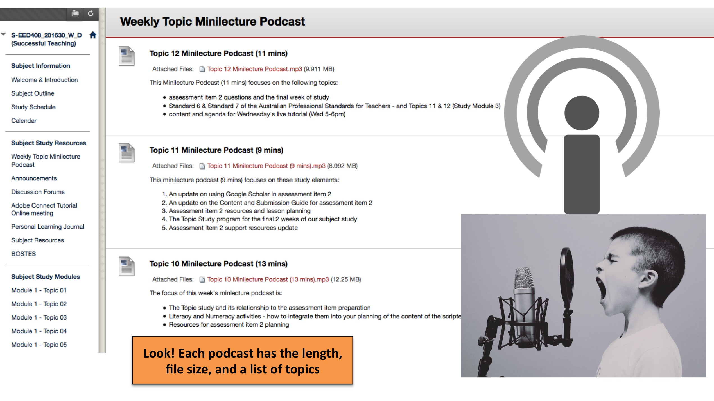
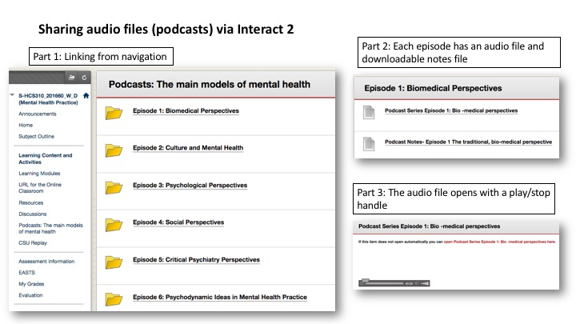

---

layout: strategy
title: "Adding Voice Recordings"
category: strategy
tags: [Teacher Presence, ]
description: "Provide information and a personal touch to the subject using audio."
subjects: "EED408, HCS310, "
subjectnames: "Successful Teaching, Mental Health Practice, "

---

### Overview

Adding a voice recording is an alternative way to engage students with both information about the subject as a whole, and more specifically about knowledge and skills within topics or modules. Adding a voice recording can provide students with a convenient and user friendly way to engage with subject content and provides the academic an alternative way to establish and maintain their presence in the online environment. A particular benefit of voice recordings is their comparatively low file size which makes them easier for students to download and access on a range of devices.   

### Engagement

One of the key intentions of enhancing and maintaining a sense of teacher presence within the online environment is providing students with a genuine sense of being in the hands of a passionate, knowledgeable and skilled online teacher. Providing content in a range of formats not only demonstrates a level of competency in the online environment and therefore increase student confidence in the quality of their education, but also allows students to access content in a more flexible manner. As the barriers to accessing and engaging with content are lowered, it is hoped that engagement is subsequently increased and learning deepens. Audio mediums have the potential for to allow academics to speak in a range of ways to students, but lend themselves particularly well to more conversational/relaxed styles of presentation. Such flexibility allows the instructor to either position or reposition themselves in terms of tone utilised and content areas focused upon. For example, an audio recording may be instructional in nature and therefore highly structured (i.e. providing a detailed breakdown of expectations on a forthcoming assessment task) or alternatively, may be much more informal and reflective (for example, a ‘chat show’ style podcast on topics relating to the area of study). Whatever the purpose, audio voice recordings can help support the central aim of engagement in online learning.  

### In Practice

#### Subject

EED408 Successful Teaching

#### Teaching Staff

Paul Grover

#### Motivation

A regular podcast created by the lecturer provides a personalised message that supplements and enhances any text-based message available online or via email. In this subject weekly ‘mini-lecture podcasts’, amongst other things, keep students informed of key concepts to focus on and pending assessment considerations.

#### Implementation

A separate link from the navigation takes learners to a new page called ‘Weekly Topic Minilecture Podcast’. Each weekly podcast is listed with useful and pertinent information: title, link to download file, size of file, length of podcast, and bullet-point list of what topics are covered. Listing a summary of the content shows teacher consideration for student time and effort - if the information listed is already known by the student then perhaps the full podcast does not have to be accessed that week.

{: .u-full-width}

#### Subject

HCS310 Mental Health Practice

#### Teaching Staff

Ruth Bailey

#### Motivation

These audio files were created to add a rich set of material to the module content. The lecturer is a workplace expert in mental health and shares experiences and practices which add an excellent dimension to the subject and provide discussion points around real-world scenarios.

#### Implementation

In this example the audio files are created using an iPad and an audio recording app. This creates an MP3 file that is then simply uploaded to the Interact2 site. A new content page is set up, with each audio topic having a new folder. This avoids having all audio files on the same page - which can be a problem if files are set to ‘auto play.

{: .u-full-width}

### Guide

Audio is a powerful tool when used effectively. Aim for "short, sharp and punchy" podcasts from 2-15 mins in length. Creating and sharing audio files as .mp3 or .aac is recommended, ensuring the file can be played on all devices. A great way to start each podcast is to clearly identify yourself and the purpose of each podcast. Naming conventions and dates for each file are equally as important for your students and your own records.

### Tools

There are multiple ways to record and upload an audio file for students. You can use a handheld Digital Voice Recorder (picture the type used by journalists), a headset at your computer or even your mobile phone. A number of Schools throughout the university have purchased Digital Voice Recorders so please check before purchasing your own. Most newer models record in MP3 but if the device you have does not permit MP3, you could [use a program](https://cloudconvert.com/) to converts to MP3 for free.

Create audio files by recording using the following:

* If using a PC try Audacity (available free from [https://ninite.com/](https://ninite.com/) ) or on a Mac use GarageBand (Podcast option)
* Free or very cheap Smartphone apps from iTunes and Google Play store (link to more detail)
* SoundCloud [https://soundcloud.com/](https://soundcloud.com/)
* A mobile device such as an iPhone or iPad using Voice Memos app or any other free for audio recording app

Host or link to audio files in Interact 2:

* Attach the audio file as demonstrated in the examples above
* Embed cloud based audio using a URL (i.e. Soundcloud)
* Create RSS feeds from professional networks and media such as ABC radio
