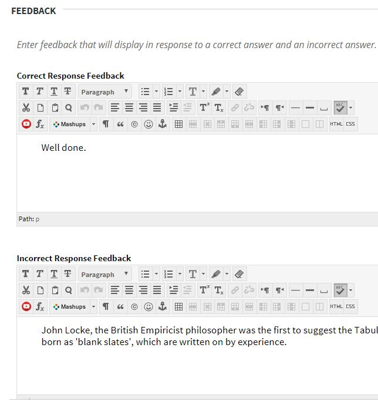

---

layout: strategy
title: "Automated Feedback"
category: strategy
tags: [E-Assessment,]
description: "Provide detailed feedback to the student through system-generated responses."
subjects: "MTH135, GPM512"
subjectnames: "Mathematics And Statistics In Health Sciences, Executive Leadership in Law Enforcement and Security"
label: TOL

---

### Overview

Using a variety of learning tools, this strategy refers to assessment activities attempted by the student, which then result in system-generated responses regarding their attempt and the content addressed. This strategy offers more detailed feedback to the student than typically associated with automated assessment items, thereby facilitating increased opportunity to consolidate learning and increased efficiencies for example resource use by the academic to focus on supporting higher stakes assessment items.

### Engagement

Potentially, the use of automated feedback with formative assessment items or progression tasks can provide an additional engagement layer to the learning and teaching delivery. It can scaffold personalised feedback. This is predicated however on the notions that:

1. The student is aware of the availability of the automated feedback
2. The student will review the feedback
3. The feedback provided holds value to the student (e.g. connected to current or subsequent assessment items/attempts)

### In Practice

#### Subject

MTH135 Mathematics And Statistics In Health Sciences

#### Teaching Staff

Dmitry Demskoy

#### Motivation

To replace handwritten and hand marked submissions.

#### Implementation

Interact2 quiz tool used for low-stakes formative assessment task, with incorrect responses provided by students prompting the automated feedback re. relevant content areas and considerations (connected to the correct answers).

Adobe Forms are used to create individual assessment questions which students complete and submit via EASTS. The files are downloaded and passed through MAPLE software which evaluates the answers against a set of requirements. The resulting file with feedback generated by MAPLE is uploaded back to EASTS, with students being provided the full solutions to all questions with the marked assessment.

{: .u-full-width
}

#### Subject

GPM512 Executive Leadership in Law Enforcement and Security

#### Teaching Staff

Andrew McInnes

#### Motivation

Using self marking quizzes for both formative and summative feedback and to trial PeerWise as a method of engaging and motivating students.·A subject using PeerWise begins with an empty repository. This grows gradually as the course progresses and students author and contribute relevant questions. Writing questions requires students to gain a deeper understanding of the material. Also, by writing and answering questions students develop and test their understanding and receive immediate feedback.

#### Implementation

For three assessment tasks we used PeerWise as a place for students to work collaboratively and contribute to a repository of multiple choice questions and answers:

1. Write 3 multiple choice question and answer sets on the content of 2 modules and submit to PeerWise. The questions must be relevant with clear & complete explanation, demonstrating an understanding of course content, concepts and/or ideas.
2. Answer, comment on and rate questions from the Peerwise repository to achieve the following nominated peerwise scores
>Answer Score over 300 points- *increases every time you answer a question correctly and decreases by a small amount every time you answer a question incorrectly*.
>
> Reputation Score over 300 points - *composed of individual scores for question writing, answering questions and rating existing questions*.
3. Online Test (20 questions taken from the pool of PeerWise questions)



### Guide

**MAPLE** - Considering the highly technical (and discipline specific) nature of Maple, it is recommended you contact Dmitry Demskoy or Kerrie Cullis for advice and support. Suggested application for assessment involving ‘heavy’ calculations.

**Interact2 Quiz Tool** - automated feedback consisting of all answers needs to be provided on submission. This tool potentially assists with keeping students on track when used in this way. Explicit instruction for students on how to retrieve the feedback may be required (i.e. accessing the same quiz item after submission). The Division of Learning and Teaching can provide support once academic staff submit a SRS online request.

**Peerwise** - According to PeerWise participation provides a number of learning opportunities:

- Designing questions: Generating a question requires students to think carefully about the topics of the course and how they relate to the learning outcomes. Writing questions focuses attention on the learning outcomes and makes teaching and learning goals more apparent to students.
- Choosing distractors: The act of creating plausible distractors (multiple-choice alternatives) requires students to consider misconceptions, ambiguity and possible interpretations of concepts.
- Writing explanations: Explanations require students to express their understanding of a topic with as much clarity as possible. This acts to develop their written communication skills and deepen their understanding.
- Answering questions: Answering questions in a drill and practice fashion reinforces learning, and incorporates elements of self-assessment. Students are shown how others have answered the same questions, allowing them to gauge how well they are coping in the course.
- Evaluating quality: Evaluating existing questions incorporates higher-order cognitive skills, requiring a student to consider not only the content but what makes a particular question more effective than other questions.

### Tools

- Blackboard Quiz Tool
- Adobe Forms
- MAPLE
- EASTS
