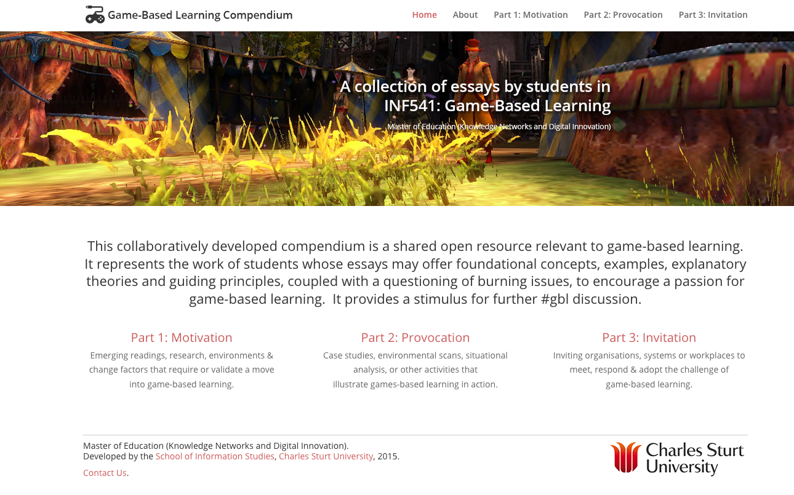
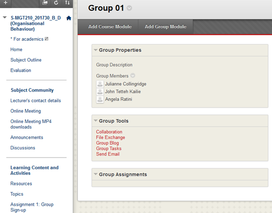

---

layout: strategy
title: "Co-Creation of Resources"
date: 2018-12-17 11:50:00 +1100
category: strategy
tags: [Interaction Between Students]
description: "Students working together to produce shared learning resources."
subjects: "MGT210, INF541"
subjectnames: "Organisational Behaviour, Game Based Learning"
label: new

---

### Overview

Students work together on tasks that result in the co-creation of resources. Resources can take many shapes and forms including wiki’s, Interact2 groups tool, videos, reading lists, glossaries, video playlists, curated online resources through to research projects and data collection. Students can work together on these resources or take individual roles; e.g. researcher, writer, editor, designer, publisher.

### Engagement

Students engage with the content and each other as they collaboratively explore the subject material. The student-to-student focused approach to this task can be a valuable way of unlocking the virtual learning environment, teaching students to problem solve issues around access, time zones and locations - a valuable workplace skill for teamwork in the 21st century.

### In Practice

#### Subject
MGT210 Organisational Behaviour

#### Teaching Staff
Dr Arnela Ceric

#### Motivation
As Arnela states in her introduction to students "I prefer generating active participation from students as this fosters a positive learning environment. I hope to inspire you to be intellectually curious and become sophisticated business leaders." This collaborative actively promotes participation, providing opportunity for students to learn from each other, and foster positive collaborative environments.

#### Implementation
Students are required to analyse the popular TV show “The Office”, and in self enrolled groups, work together to create a report with the requirements specified below:

Both, assignment 1A and 1B, are based on group work, and hence, you are required to form a group of minimum three and maximum four members in week two of the session. Group members need to self-enrol in a group by using Interact2 tool: Groups. Your task in this assignment is to develop an outline of a report focusing on analysis of employee motivation in an episode of a TV show ‘The Office’ (American version). You can watch the TV show through the CSU Library, EduTV database.

{: .u-full-width}

#### Subject
INF541 Game Based Learning

#### Teaching Staff
Kylie Hutchings Mangion

#### Motivation
The subject INF541 is designed as an introduction to understanding the potential role of games and gaming for learning in the digital age.

Assessment 4 - Compendium chapter proposal - Students work collaboratively with peers to develop a chapter proposal for Compendium: Game-Based Learning 21C #gbl.

Assessment 5 - Chapter and critical reflection - The purpose is for students to become immersed in peer collaboration, peer evaluation, and peer response, to achieve mutual learning goals. Students were encouraged to respond back to the student thought-leaders making the comments, and together create the online publication Compendium: Game-Based Learning 21C #gbl.

#### Implementation
A wiki (http://wikispaces.com) is used for students to share proposals and interact around the collaborative task. CSU Thinkspace is used as a platform for students to share their final work. This provides for an ongoing compendium of work from one year to the next with students building and co-creating a knowledge resource for others to use as well.

The experience is intended to position game-based learning as the topic of open scholarly discourse, available for students, educators and practitioners alike, and where feedback and commentary is part of the participatory learning of online environments and in keeping with the flexible and learner-focussed cognitive frame of #gbl.

{: .u-full-width}

### Guide
Whilst individual user guides are often available for whichever tool/platform is used for the collaboration, a critical consideration for this strategy is ensuring that all team members have access and the skills required to contribute. Think about the sustainability of the activity/platform over subsequent sessions, with new students and new staff.  

### Tools
- Mindmeister - Mindmapping tool for online collaboration (depth on discussion will depend on how it is facilitated)
- Google Docs
- Blogs
- Wikis
- Dropbox
- VMR and Video Chat

### Further Reading

O’Connell, J. (2016). *Networked participatory online learning and challenges for academic integrity in higher education*. [Retrieved from](https://heyjude.files.wordpress.com/2006/06/o-connell-2016-international_journal_for_educational_integrity.pdf). International Journal for Educational Integrity . 12:4 http://doi: 10.1007/s40979-016-0009-7

