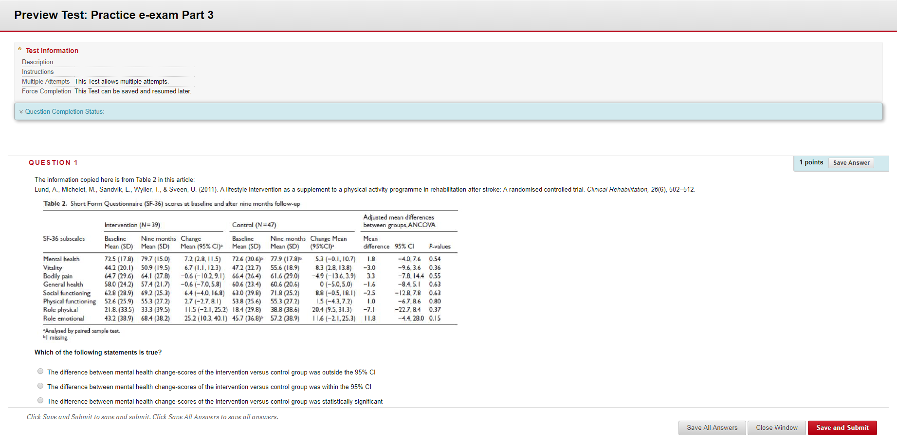
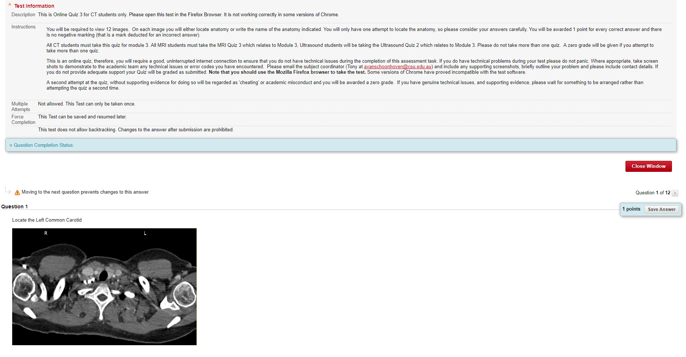

---

layout: strategy
title: "Computer Based Exams"
date: 2018-12-15 10:15:00 +1100
category: strategy
tags: [E-Assessment,]
description: "Utilising the affordances of digital technologies to enhance examinations and create rich authentic tasks."
subjects: "HIP202, MRS544"
subjectnames: "Research for Health Practice, Clinical Sectional Anatomy"
label: new

---

### Overview

Computer-based exams can be designed as either a formative or summative assessment, with summative assessment used to establish whether students have attained set goals and formative assessment providing feedback to assist students in reaching their goals (Terzis and Economides 2011). Benefits of computer-based exams include test security, cost and time reduction, speed of results, automatic record keeping for item analysis and the ability to test at a time and location convenient to the students (Terzis and Economides 2011).

Although online exams are often thought to be less successful in achieving higher order learning, it is now recognised that the affordances of technology can be used to create a rich and authentic task for students (Herrington et al. 2009; Gikandi et. al. 2011). For example, computer-based exams can embrace tasks requiring the use of specialist software like Computer Assisted Design tools, computer programming environments, accounting packages and spreadsheets and also include tasks where students are expected to search for and synthesise information from online sources.

Issues around plagiarism and cheating in online exams can be overcome with a range of design aspects. These include strict time allocations; question randomisation; the use of open book exams; or the use of invigilators, which would allow students to sit exams at their homes or workplaces.

### Engagement

Computer-based exams provide students with a contemporary and flexible method of completing assessment tasks. This approach is in keeping with the technology that students use to complete other assessment tasks and is a more flexible practice than that which requires students to travel to an exam centre to sit a paper-based exam.

### In Practice

#### Subject
HIP202 Research for Health Practice

#### Teaching Staff
Kylie Murphy

#### Motivation
This second year subject is common to the majority of students in the School of Community Health at CSU. The subject aims to start students on the journey to becoming evidence-based health practitioners. It is designed to provide an introductory experience to utilising information and research and applying this knowledge to the specific problems of their health discipline/s. Students learn a range of skills and are given the opportunity to implement them. This includes: development of sophisticated database search terms (including Boolean operators); creating and saving database permalinks; and understanding the structure and function of a wide range of research approaches and reporting conventions. During the course of the subject, students develop skills in solving authentic problems, and in light of this it was clear that there was a misalignment between the subject and its main assessment task, a paper-based exam. Providing students with a large collection of printed resources was both unauthentic and wasteful.

#### Implementation

Creating a task to replace the paper-based exam involved first ensuring alignment between subject outcomes and the assessment task; and then ensuring students could access a fair and well designed assessment which was supported by current CSU platforms. The e-exam enabled students to demonstrate their ability to search databases for research on a given question and upload and evaluate the validity and relevance of their findings. The Interact2 test centre was chosen as the platform because of the support available and - through an extended period of testing and trialling - the ability to remove technical glitches. More than 190 students completed the assessment task simultaneously in a three-hour period during exam week in July 2016, with all three student cohorts reporting increased satisfaction with the subject and the assessment practices, as measured by the student experience survey.

{: .u-full-width}

#### Subject
MRS544 Clinical Sectional Anatomy

#### Teaching Staff
Tony Van Schoonoven

#### Motivation
MRS544 is a subject taken by students from around the world. The challenge was to find a mode of testing that students could access from their different time zones. The time settings associated with the Interact2 test centre meant the quiz could be open for a period of time that enabled students across different time zones to access and complete the test. The settings could also be used to restrict multiple attempts at the test. The ability to use random ordering of questions diminished the collaborative effect of students who might consult with each other when taking the test.

#### Implementation
The online assessments were created at the end of each module using Interact2 test centre. There was a time frame where each assessment was open and only one attempt was allowed. The record of activity in test centre allowed us to check student login times if issues came up about ‘not being able to log in’ or logging in outside of the required time frame. The ‘hotspot’ style of questions were most successful because it negated the need for students to ‘write the name of this part of the anatomy’. The latter was inherently problematic for students around the world who might use different terminology and spelling, and when it was used the answers had to be manually checked because they may have been correct despite not conforming to the test centre version of the ‘correct answer’.

The main problem encountered with the quizzes was an issue relating to particular browsers. The Interact2 test centre is not compatible with all browsers and there are many different ones used around the world. Therefore, as part of the instructions for the online test, instructions on which browsers to use had to be included. While the test centre did allow images (JPG format) to be uploaded easily, there were some formatting issues, again with some browsers.

{: .u-full-width}

### Guide

If you are looking to implement a computer based exam within your subject/s, there are some important considerations to make when planning this approach:

* Integrity – given that many exams at CSU are relatively high stakes, it is important to take into account the ways which you will maintain the integrity of the assessment task so that students are assessed on a level playing field. If you are planning on utilising the increasing range of remote invigilator services available these concerns are somewhat minimised as the student’s identification will be verified by the invigilator.
* Design – if you are not planning on utilising invigilator services, the design of the exam can increase the integrity of the assessment. For example, an exam containing extended answer sections to complement multiple choice questions gives you as the assessor greater opportunity to cross reference any work against the student’s prior performance within the subject.
* Exam platform – it is possible to build an effective e-exam within the interact2 test environment. A growing practice is the creation of one overall exam which consists of several ‘tests’, each of which can only be accessed after the previous one has been reviewed and submitted. This has several advantages including the fact that you can choose to make students complete the exam in a specified or random order, and as a result it minimises chances for integrity breaches. In addition, there are a range of functionalities such as the ability to store audio, video and files within the test environment, these being available from other areas of your subject site. Additionally, utilising the supported test centre functionalities within interact2 means that you can schedule specific opening and closing times for these assessment tasks, meaning that support can be organised around this timeframe.
* Another effective safeguard in ensuring integrity is undertaking a range of pre-moderation activities. In a typical exam environment, students will be presented with the same scenario. In an e-exam, it is possible to present a range of scenarios in which students are asked to apply knowledge and skills. Key to this is the development and pre-moderation of a range of equivalent scenarios that students must respond to. The alternative to this aspect is providing one scenario but a range of ways to respond. Building a range of options makes it harder for collusion to occur, but it is important to follow a rigorous pre- moderation process.
* There are other non-supported technologies for offering e-exams, but utilising these is problematic as they will not link to CSU systems such as grade centre. In some situations bespoke solutions can be created in order to embed currently unsupported software platforms, but this process requires an extensive planning and implementation time frame.
* A team development process is crucial – you need to have the people around with the right skills to turn your innovative assessment vision into a reality. An educational designer can support you with facilitation and project management of the task.
* Sustainability versus ‘do-ability’ – at some point, when you have less support, will you be able to carry out some of the troubleshooting yourself? Investing time upfront in understanding how the system will work will gain you time in the long term.
* Starting point – critically analyse what you are offering as assessment, not just how you are offering it. Consider all parts when undertaking assessment changes, the who, what, when, where, how, why … and for who.
* Be explicit in linking between learning outcomes and design of the e-exam – particularly useful so that everyone can see why changes are being made in a subject.
* Integrate the e-exam into the delivery of the subject, for instance, providing advance notice through announcements, practice e-exams, pre-emptive student troubleshooting tips, and familiarisation. In essence, consider the user experience of your e-exam.

### Tools

Interact2 – various tools including Test Centre and Grade Centre are important in the design and development of your computer based exam.

Content Creation – you may need to utilise a range of tools including word processing programs such as Word or Pages. Alternatively, Test Centre does have a range of content creation tools including Word/Audio/Video which can be deployed in the test environment.

### Further Reading

Gikandi, J. W., D. Morrow & N. E. Davis, 2011. Online formative assessment in higher education: A review of the literature. *Computers & Education* 57(4):2333-2351.

Herrington, J., Reeves, T. C., Oliver, R. 2009. *A practical guide to authentic e-learning*: Routledge.

Terzis, V. & A. A. Economides, 2011. The acceptance and use of computer based assessment. *Computers & Education* 56(4):1032-104.

