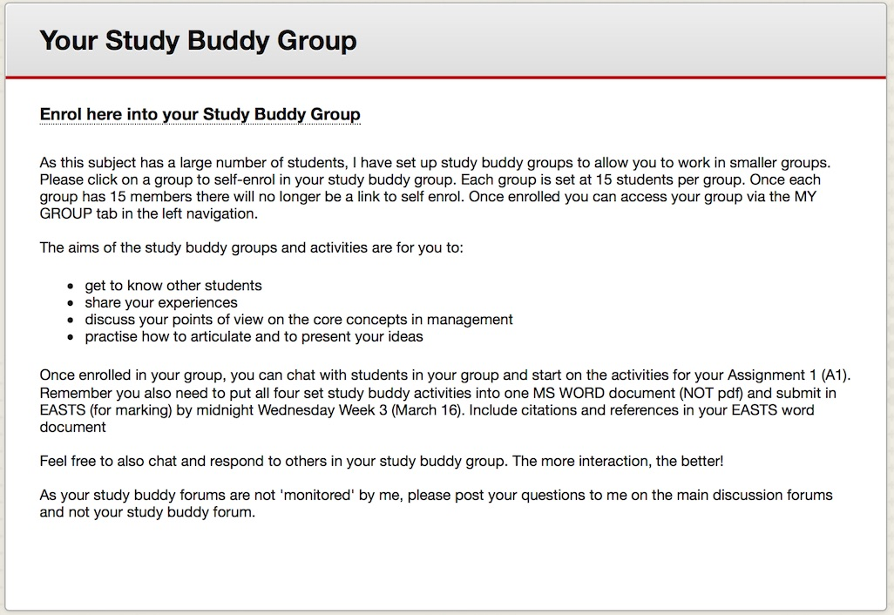

---

layout: strategy
title: "Dividing Large Cohorts"
category: strategy
tags: [Learning Communities, ]
description: "Create small groups to increase interation and participation."
subjects: "MGT100, EMC305,"
subjectnames: "Organisations and Management, Investigation: Mathematics, Science and Technology, "

---

### Overview

This strategy entails dividing up a large cohort of students into smaller sub-cohorts. These sub-cohorts allow for teaching and learning to occur in a more manageable way, making it easier for students to interact with each other as they are less likely to be lost or overwhelmed. It can also make it easier to allocate teaching staff to specific groups of students, ensuring those staff members can then take a more active role in the facilitation of discussions, marking of assignments and providing feedback as well as answering student queries.

Interactions which occur within sub-cohorts may be complemented by cohort-wide gatherings; as in the case of an online meetings in which all students come together to share findings or participant in question and answer time.

### Engagement

Small groups are beneficial to online students in large cohorts because they have the potential to provide an increased sense of connectedness and belonging. By increasing the likelihood of students interacting repeatedly with other students, it also improves chances that they will form bonds with their peers.

### In Practice

#### Subject

MGT100 Organisations and Management

#### Teaching Staff

Wendy Webber

#### Motivation

MGT100 Organisations and Management is one of the foundational management subjects within the Faculty of Business at CSU. The motivations for running a small grouping pilot were (and remain) multifaceted.

#### Implementation

A key lesson from this pilot would be that ‘compulsory’ group membership and engagement up to the first assessment supported the aims of the project, which was to make students comfortable and engaged in the online learning space.

{: .u-full-width}

#### Subject

EMC305 Investigation: Mathematics, Science and Technology

#### Teaching Staff

Amy MacDonald

#### Motivation

Students self-enroll into tutorial groups. Each group belongs to a tutor. Each tutor has a photo and brief bio presented on the subject’s homepage, so students may opt to go with a tutor who has similar interests or expertise in an area of interest to the student. This strategy also streamlines some of the administration associated with large cohorts as each tutor group is set to allow only the number of students each tutor is contracted to support. Tutor groups complement the regular ongoing, cohort-wide discussions which occur using online meeting and the main discussion board.

#### Implementation

Groups were created using the Interact2 Group tool and creating a welcoming homepage which introduces each tutor.



### Guide

Consider why you want students to engage in a grouping strategy.

* Is it to collaborate in an authentic manner?
* Engage students early to help familiarise with the online learning space?
* Develop some peer connections?

There are many reasons why you would choose a grouping strategy within a large online cohort, but keeping one or two of the most key reasons in mind helps to clarify both what you expect of students and what the students can expect of you.

Consider the practical implications-in large cohorts of hundreds of students, what strategies will you implement to ensure that the grouping process is a positive for both you and students? For example, how likely is it that you will be able to communicate in a nuanced way with students in (potentially) 20+ small groups without considering workload and logistical aspects? Having a timely discussion with your Head of School and Course Director as well as learning design support about the grouping strategy you’d like to trial can provide the impetus to explore how workload of casual teaching and marking staff can be used to support the objectives of your planned changes. Having an active student mentor to support the academic in fielding questions and providing responses in a large first year cohort such as this seemed to provide some alleviation to the communication demands inherent in a grouping strategy.

### Tools

**Blackboard** provides a basic grouping tool that allows each group to be provisioned with their own set of tools for collaboration and communication. uImagine are currently working on a new grouping tool for Blackboard to provide more options and to make the process quicker.
