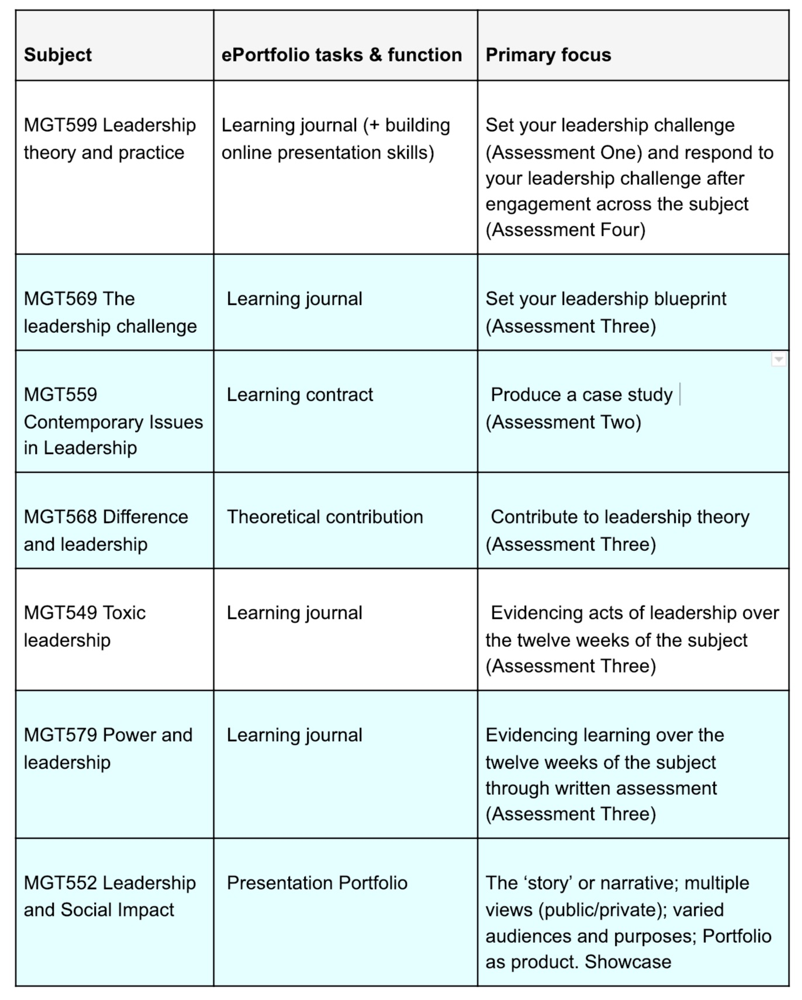

---

layout: strategy
title: "Personal Learning Networks"
date: 2018-12-17 11:30:00 +1100
category: strategy
tags: [Learning Communities]
description: "Provide students an opportunity to connect with their profession."
subjects: "MGT599, MGT569, MGT549, MGT579, & MGT552"
subjectnames: ""
label: new

---

### Overview

The term *Personal Learning Networks* (PLN) describes the communities and tools that an individual uses to extend their learning. It includes connecting with peers within and beyond the subject, course or institution through social media, especially through sharing, curating and commenting on each others’ posts. PLNs allow students to develop an online professional presence, as in the case of an ePortfolio or blog. Students may share postings with classmates or publish their work externally.

### Engagement

PLNs enable peer-to-peer engagement and potentially engagement with the profession. When embedded throughout a course, the application of personal learning environments shifts. In the early stage of study PLNs may be used to develop reflective practice, as in the case of a learning journal. As students progress in their studies they may create more public artefacts, building a professional profile.

### In Practice

#### Subject
Within the Master of Business Leadership (MGT599, MGT569, MGT549, MGT579, & MGT552)

#### Teaching Staff
Michelle Evans, Hedy Bryant, Zelma Bone

#### Motivation
to foster self-directed learning and reflexive practice

#### Implementation
Students develop a Thinkspace ePortfolio throughout the duration of the course. During the first session (MGT599) students begin their ePortfolio by blogging about professional aspirations and personal goals. This coincides with learning basic skills required to use Thinkspace. In MGT569 and MGT549 students continue to build their ePortfolio with ‘learning journal’ entries either as blog posts or pages within their Thinkspace ePortfolio. These artefacts may be shared with classmates or externally. In MGT552 students create a presentation section within their ePortfolio showcasing their work.

{: .u-full-width}

### Guide
Similar to the strategies employed within the Master of Business Leadership, Dabbagh and Kitsantas (2012) provide a three level model for implementing a PLE plan. They propose considering each PLE (such as a blog or social media site) within the context of:

1.	Personal information management
2.	Social interaction and collaboration
3.	Information aggregation and management

Application of this 3 level model using CSU Thinkspace may look like this:

*Implementing a learning journal throughout a subject.*

First students would be asked to create a blog post relating to their personal learning goals within the subject. Secondly, students might be required to share a second blog post with classmates in which they reflect upon their learning. Comments from others would be encouraged. Finally students create an ePortfolio page showcasing their learning which is shared more widely.

### Tools

Although there are many options which could be considered, CSU Thinkspace is recommended to those considered PLNs as it is supported by CSU and provides students with a professional, industry standard application. See[ http://thinkspace.csu.edu.au/](http://thinkspace.csu.edu.au/)

### Further Reading

Casquero, O., Ovelar, R., Romo, J., Benito, M. & Alberdi, M. (2016). Students’ personal networks in virtual and personal learning environments: a case study in higher education using learning analytics approach. *Interactive Learning Environments, 24*(1), 49-67.

Gewerc, A., Montero, L. & Lama, M. (2014). Collaboration and social networking in higher education. *Comunicar*, 42(21), 55-62.

Marín Juarros, V., Salinas Ibáñez, J., & de Benito Crosetti, B. (2014). Research results of two personal learning environments experiments in a higher education institution. *Interactive Learning Environments, 22*(2), 205-220.

Marín-Díaz, V., Vazquez Martinez, A. I., & McMullin, K. J. (2014). First Steps Towards a University Social Network on Personal Learning Environments. *International Review Of Research In Open & Distance Learning, 15*(3), 93-118.

Dabbagh, A. & Kitsantas, A. (2012). Personal learning environments, social media, and self-regulated learning: A natural formula for connecting formal and informal learning. *Internet and Higher Education 15*(1), 3-8.

ELI (2009). *7 Things you should know about personal learning environments*. Educause Learning Initiative. Casquero, O., Ovelar, R., Romo, J., Benito, M. & Alberdi, M. (2016). Students’ personal networks in virtual and personal learning environments: a case study in higher education using learning analytics approach. *Interactive Learning Environments, 24*(1), 49-67.

