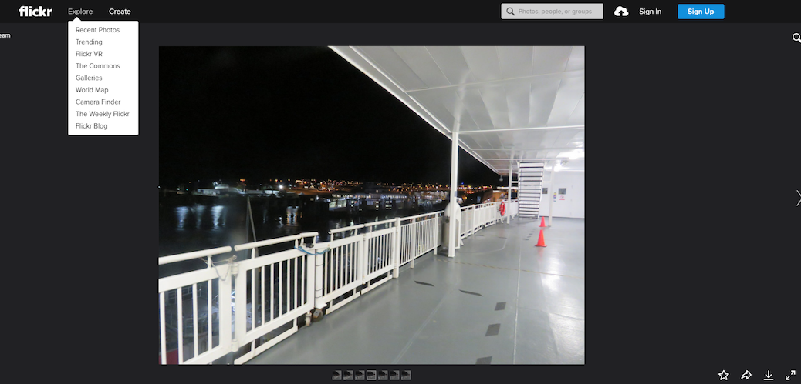
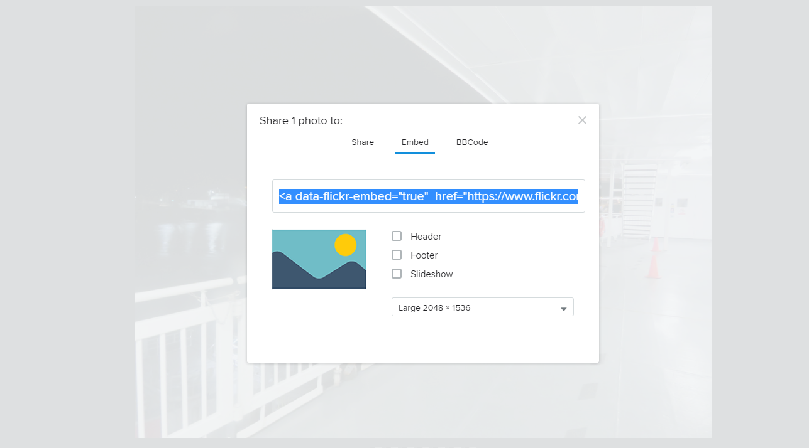
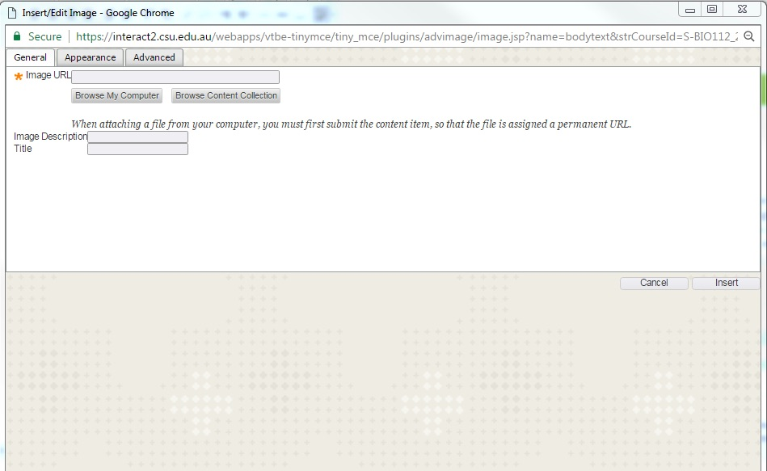

---

layout: strategy
title: "Photographs and Images"
category: strategy
tags: [Teacher Presence, ]
description: "Adding visual content to support communication & understanding."
subjects: "BIO112, HCS102, "
subjectnames: "Principles of Ecology, Communication and Human Services, "

---

### Overview

Adding photos and relevant, stimulating images to a subject site helps teachers present content they are delivering and assessing in a more holistic and engaging way. Adding photos and other illustrative images can assist in increasing student engagement because it provides support for content understanding, points of interest and items to stimulate discussion. This is particularly important in the early stages of a subject, where students are confronted with significant volumes of information synthesise and prioritise. Stimulating, relevant images can provide the teacher with a useful mechanism for engaging students in dialogue about the subject.

### Engagement

The use of photos and images can include alternative approaches to collation, curation and presentation through collage, slides and standalone versions. This has the potential to connect students with the subject content and support engagement through embedding and/or linking to images.

### In Practice

#### Subject

BIO112 Principles of Ecology

#### Teaching Staff

Dale Nimmo and Manu Saunders

#### Motivation

This strategy of adding photos and relatable images helps to enhance a sense of professionalism and helps students engage with the overall themes of ecology and biology within the subject.

#### Implementation

In this example, the subject features a number of ‘GIFs’ on the home page which add interest. These GIFs are held in place in a table and included from the original source destination via the ‘insert image via link’ option of the page editor.

{: .u-full-width}

#### Subject

HCS102 Communication and Human Services

#### Teaching Staff

Susan Mlcek

#### Motivation

This subject employs images of Matryoushka dolls as an analogy in different ways.

#### Implementation

Images of the dolls are sprinkled throughout the modules, landing page and announcements.



### Guide

Adding photos and relatable images to a subject site can be a relatively straight forward process. A few things to think about include:

* **Copyright** – Ensuring that you either own the image or have permission to use it is important, as it correctly attributing the image to the owner/copyright holder. There are many free ‘stock photo’ providers out there, but where possible, an authentic photo featuring either yourself or (e.g.) past students or real world settings have a better impact than stock images. Ideally, photos should be stored in DOMS, the official CSU digital records repository
* **Context** – Photos will be more useful if they somehow build interest in the content matter. This might include you the academic demonstrating application of the content matter in the real world; it may be a photo of a future job site or simply be an interesting and related background image.
* **Use throughout the site** – Photos do not need to only reside on the ‘front page’ of a interact2 site. There is opportunity to use photos in areas such as Adobe Connect meetings as an icebreaker.
* **Multimedia** - There are a number of tools available which allow features such as carousels which can display photos in an attractive way. These need to be tested on a case by case basis. Another interesting alternative is the ability to use instagram as a source of photos which (depending on permission levels) can be embedded into a html editor, including the text editor in interact2.

### Tools

Tools in this example generally consist in a couple of broad areas:

**Capture:**

* **Camera** – using a dedicated camera will always deliver the best result, although being aware that high quality cameras such as DSLR’s will sometimes capture higher quality than what is needed, and may impact on performance speeds as interact2 loads these images each time, making it slower for students.
* **Phone** – cameras on phones are ubiquitous and convenient, and in most cases will do a satisfactory job of capturing an image. More challenging situations such as low light or moving images may present challenges and result in an inferior product.
* **Action Cameras** – cameras such as GoPro’s have presented new ways to capture images ‘on the go’ in recent years and provide a nice middle ground between quality and convenience (and greater durability)
* **Drones** – Drone footage and image capture has increased dramatically in recent years, although it is worth noting that in many situations a licence is required to both fly and capture images, especially in urban or built up areas.   
* **Other** – Includes webcams and laptops and other devices whereby a bespoke approach and knowledge is required (such as microscopes).

**Publish:**

* Social publishing options include instagram and facebook amongst many other options, and both these services and others generally provide an option to generate an embed code for photos.
* Photos taken by the individual can also simply be stored on the local device such as phone, computer, ipad, for later usage.

**External Sourcing:**

There are two main ways to include a (properly attributed) image from an external source onto your interact2 page. The simplest way is to find one of the large ‘stock photo’ providers or better still, use a creative commons based/option site such as [Flickr](https://www.flickr.com/creativecommons/) and search for the photo you would like to use. Using the Flickr example, the process would include:

1. Identifying the preferred photo
{: .u-full-width .sml-padding}
2. Selecting the ‘share tab’ in the bottom right hand corner and then clicking the ‘embed’ tab’, bearing in mind that in many instances, sharing platforms such as Flickr allow the use of direct link as well as an embed code.
{: .u-full-width .sml-padding}
3. Using the interact2 ‘insert image’ option on the editor will bring up the following screen which allows you to utilise either the embed code or the direct link url from Flickr.  
{: .u-full-width .sml-padding}

**From other sources:**

In some cases there may be no obvious way to link or generate an embed code but it may be possible to ‘right click and save’ the image to the desktop, or failing that, a screenshot may be captured. This will result in a lower quality image and will still require attribution.  
