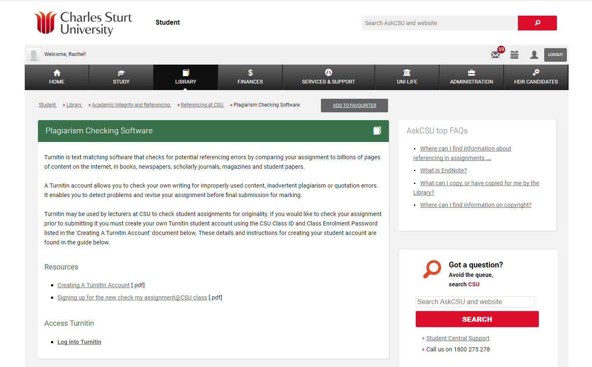

---

layout: strategy
title: "Plagiarism Checking"
date: 2018-12-15 10:30:00 +1100
category: strategy
tags: [E-Assessment,]
description: "Help to build students academic skills and rigour into their studies."
subjects: "BMS346, "
subjectnames: "Genomics, Proteomics & Bioinformatics"

---

### Overview

The ease with which students have access to information has produced an increasing temptation for students to copy material and hand it in as their own work. Taking the text of others and using it without proper referencing or acknowledgement is a commonly accepted definition of plagiarism (Culwin and Lancaster 2001). More specifically, student plagiarism can be defined as a form of cheating with the intent of gaining academic credit for work which is not their own and academic institutions should be concerned about this since student plagiarism appears to be on the increase (Culwin and Lancaster 2001; Park 2004).

Many students do not view the risk of being caught for plagiarism as serious enough to change behaviour and stop cheating with some authors indicating that students weigh up the benefits of cheating against the risk and the consequences of being caught (Park 2004). As a result, Park (2004) concludes that one of the best deterrents to plagiarism is the development of a robust system that is appropriate, fair, transparent and well publicised and consistently used across the university.

During the last decade, electronic plagiarism detection has advanced greatly and once cumbersome detection techniques have become straightforward and routine for both academics and students with systems such as Turnitin.

### Engagement

Studies such as Dahl (2007) have found students welcome the introduction of plagiarism software as a way to prevent plagiarism. Specifically, students seemed to like the formative aspect which allows them to seek advice on how to reference correctly if reports identify an issue prior to submission. The knowledge that plagiarism software is being used has also worked as a deterrent to decrease plagiarism and better understand referencing and writing techniques.

### In Practice

#### Subject
BMS346 Genomics, Proteomics & Bioinformatics

#### Teaching Staff
Padraig Strappe

#### Motivation

CSU expects that the work of its students and staff will uphold the values of academic honesty and integrity and has developed [The Guide to Avoiding Plagiarism](http://student.csu.edu.au/library/integrity/plagiarism). Students are expected to familiarise themselves with these requirements and ensure that all assessments submitted are their own work, have not been submitted elsewhere and comply with the University's requirements for academic integrity.

CSU has access to Turnitin software which can be used in a pre-emptive function for students to check their own work prior to submission, and a plagiarism detection function which academics may use to check the student’s work for improper citation or potential plagiarism. The use in this subject is optional and is not a prerequisite for submission. However, students are encouraged to check their work for originality prior to submission.

#### Implementation
In BMS346 students are directed to Turnitin from the subject outline to check their own work. They are asked to declare that the assignment is their own work (using an electronically signed statement through EASTS) and that they are aware of the policy and plagiarism detection tools.

As well as referring students to Turnitin, they are also given information on:
- referencing styles,
- how to reference, including use of referencing programs such as Endnote,
- how to perform a literature search, and
- how to transfer knowledge into their own words.

{: .u-full-width}

### Guide
Guide to using the plagiarism checking software [Turnitin at CSU](https://www.csu.edu.au/division/learning-and-teaching/interact2_help/faculty-and-csu-staff/assessment/turnitin).

### Tools

[Turnitin](http://www.turnitin.com/) is used for plagiarism checking at CSU

Student information on [Plagiarism Checking Software](http://student.csu.edu.au/library/integrity/referencing-at-csu/checking)

### Further Reading

Culwin, F., Lancaster, T. 2001. Plagiarism issues for higher education. *Vine* 31, 36-41.

Dahl, S. 2007. Turnitin® The student perspective on using plagiarism detection software. *Active Learning in Higher Education* 8, 173-191.

Park, C. 2004. Rebels without a clause: Towards an institutional framework for dealing with plagiarism by students. *Journal of further and Higher Education* 28, 291-306.

