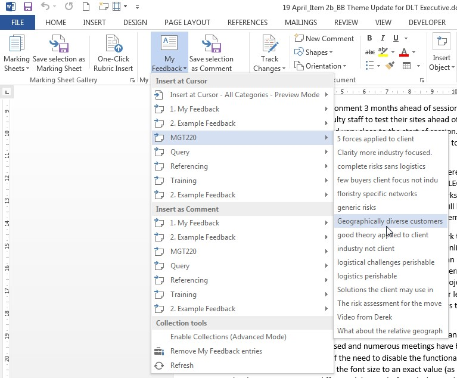

---

layout: strategy
title: "Rubrics"
category: strategy
tags: [Flexible & Adaptive Learning, ]
description: "Use rubrics to provide more informative assessment tasks and faster feedback."
subjects: "eCommerce, "
subjectnames: "MGT220, "
label: TOL

---

### Overview

A detailed interactive rubric enables rapid marking and hence rapid return of assignments. The process is semi automated as the marker needs to select the degree of achievement students have attained for each assessable element.

Rubrics allow for detailed feedback across the assessment elements and facilitate consistency across different markers. Rubrics can be in the form of subject rubrics for the students, marking rubrics in NORFOLK, or rubrics attached to items in Blackboard.

### In Practice

#### Subject

MGT220 eCommerce

#### Teaching Staff

Sam Parker

#### Motivation

To manage marking of this large cohort  a comment bank has been developed over time of pre-prepared responses assisting in rapid turn around. Timely feedback is required in this subject as students can complete the case studies at any time during the session but are required to receive feedback from the previous case study before they submit the next, allowing the opportunity for feedback to be of use in subsequent assessments.  

#### Implementation

Through the creation of a comment bank with relevant feedback in NORFOLK, marking time can be reduced allowing the possibility for rapid return.  Feedback can be stored under categories such as presentation or referencing.  

Video  feedback of a general nature has also been added to support the rubric feedback. The pre-recorded videos are embedded within the rubric to accompany detailed notes.

{: .u-full-width
}

### Guide

It takes a long time to set up detailed rubrics so it is best utilised in large subjects where summative feedback for groups of students may be ultimately time saving.

### Tools

For the features of NORFOLK use this link:  [https://www.csu.edu.au/csued/program/norfolk-basics](https://www.csu.edu.au/csued/program/norfolk-basics)

For advice on the use of Blackboard rubrics (Interact2) use this link: [http://www.csu.edu.au/division/learning-and-teaching/interact2_help/faculty-and-csu-staff/assessment/rubrics](http://www.csu.edu.au/division/learning-and-teaching/interact2_help/faculty-and-csu-staff/assessment/rubrics)

### Additional Resources

