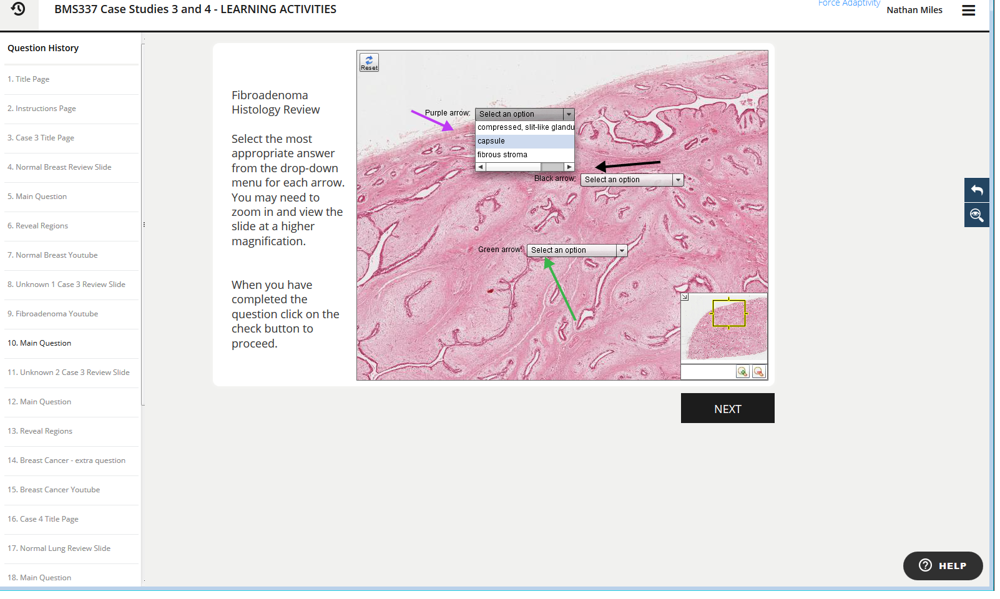
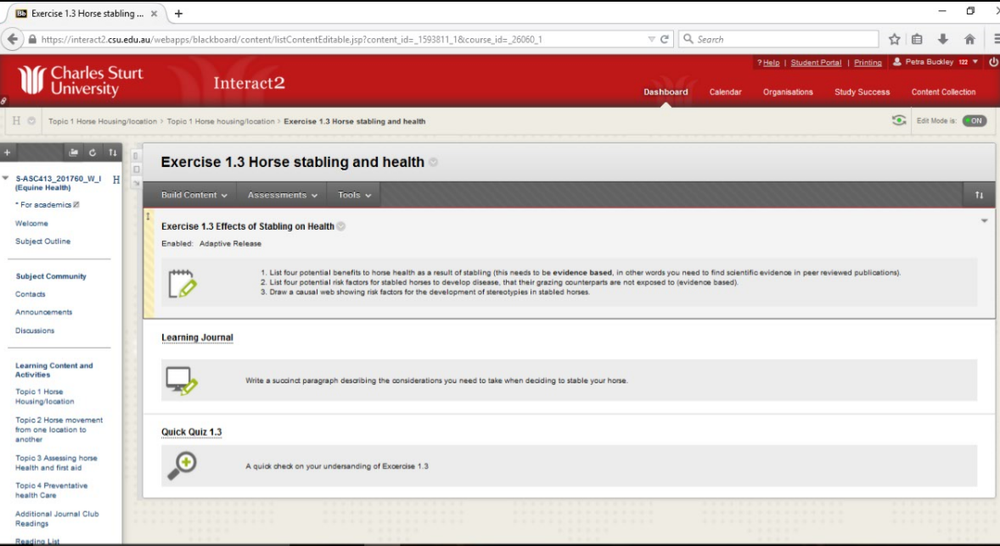

---

layout: strategy
title: "Self-Marking Quizzes"
date: 2018-12-17 10:10:00 +1100
category: strategy
tags: [E-Assessment,]
description: "Improve the efficiency of providing students formative feedback."
subjects: "BMS337, ASC413"
subjectnames: "Histopathology, Equine Health"
label: new

---

### Overview

Online self-marking quizzes have been used widely during the past decade for both summative and formative assessments. Their use is generally supported by a sound theoretical and pedagogical basis (Velan et al. 2008). In particular, with appropriate design, they are considered to provide an effective way for students to monitor their learning and comprehension and receive immediate feedback (Kearns 2012). Online quizzes also give instructors a way informally to assess students' understanding as well as supply feedback to help them correct misconceptions and adapt their learning (Kearns, 2012). Quizzes can also be used in adaptive release situations which compel students to show understanding of content before moving on to the next lesson (Kearns 2012).

Online quizzes are used extensively for early low stakes assessments and for formative assessments that aim to establish the students’ engagement and understanding of content (Angus & Watson 2009; Kearns 2012). A large scale study by Angus and Watson (2009), examining first-year business mathematics students at the University of New South Wales, suggested that regular well-structured online quizzes lead to better student learning outcomes.

### Engagement

The nature of self-marking quizzes brings significant improvements to the efficiency of the feedback loop that supports a student’s self-directed learning. Self-marking quizzes can provide students with opportunities to operate with greater autonomy in regards to their learning (Angus & Watson 2009). They provide a way to directly link students with the relevant content, concepts and ideas relating to their study.

### In Practice

#### Subject
BMS337 Histopathology

#### Teaching Staff
Kenneth Chinkwo

#### Motivation

The residential school in this subject has been entirely replaced with a series of virtual slides and case studies that are reviewed during online tutorials and are followed by a series of online quizzes or short answer questions facilitated in Smart Sparrow. The use of microscope slides and the ability to change magnification creates an authentic learning experience for students. The wide variety of question types which can be associated with images also makes this an authentic and engaging option for assessment.

#### Implementation
The learning materials and assessments are scaffolded into the subject modules, thus students are already familiar with the format and the manner of engaging with content. The seven case studies are spread over five weeks and include the content lesson, formative learning activities and the summative assessment. The case studies are compulsory, with the assessment component carrying 20 percent of the grade.

Smart Sparrow was used to create the quizzes. The focus was on building a virtual lab experience, with students able to zoom in on slides in the same way that they would with a microscope in a lab. Students found the virtual lab activity engaging and gave positive feedback. There were challenges that included:

- browser incompatibility,
- problems running the slides with slow internet speeds,
- Smart Sparrow updates which caused glitches with images, and
- the high level of skill required to update the quizzes.

However, the subject team found that these problems can be overcome, and the benefit of providing students with a satisfactory and authentic virtual residential school experience make it worthwhile.

{: .u-full-width}

#### Subject
ASC413 Equine Health

#### Teaching Staff
Petra Buckley

#### Motivation

Students were rushing through the modules in a superficial manner and not working at the depth necessary to complete the assessment tasks. The subject coordinator was looking for a teaching tool that would control student progress through the modules and provide quality assurance. Students would have to engage with the material and correctly answer core knowledge questions before proceeding with the content.

#### Implementation

The quizzes were developed in interact2 test centre using pools of questions that cover the essence of each module. The questions and quizzes are scaffolded to guide students through increasingly challenging concepts. The quizzes are linked to the adaptive release tool and must be completed correctly before the student can move on through the modules. A lot of consideration was put into writing feedback that would guide students to a deeper learning experience.

There were some teething problems when the quizzes were introduced, but these were resolved with IT support. The subject coordinator has reported that students are engaging at a deeper level with the material and having fewer problems with the assessment tasks.

{: .u-full-width}

### Guide

There are a number of practical considerations which make the use of self marking quizzes much more efficient and rewarding:

* Plan, design and map out your quiz before creating and programming it. Technologies such as Smart Sparrow and Captivate are complex but will be less so if planning has been thorough.
* If your self-marking quiz is a summative assessment task then consider ways to limit opportunities for plagiarism or collusion. This can include creating a large pool of questions that can be randomised, or setting time and date limits for the test to be taken.
* Be sure to regularly communicate the need for students to utilise an internet connection that is both reliable and has sufficient bandwidth, particularly if it is known in advance that particular experiences are likely to cause students with slower internet issues. This allows students to plan for this tasks well ahead of time.

### Tools

* Blackboard test centre: [user guide](http://www.csu.edu.au/division/learning-and-teaching/interact2_help/faculty-and-csu-staff/tests,-pools-and-surveys)
* Blackboard adaptive release: [user guide](http://www.csu.edu.au/division/learning-and-teaching/interact2_help/faculty-and-csu-staff/site-content/release-content)
* [Adobe Captivate](https://www.adobe.com/au/products/captivate.html)
* [Smart Sparrow](https://www.smartsparrow.com/)

### Further Reading

Angus, S. D., & Watson, J. (2009). Does regular online testing enhance student learning in the numerical sciences? Robust evidence from a large data set. *British Journal of Educational Technology, 40*(2), 255-272.

Kearns, L. R. (2012). Student assessment in online learning: Challenges and effective practices. *Journal of Online Learning and Teaching, 8*(3), 198.

Luu, K. (2015) Implementation of an online quiz program to support learning for all students in a first-year course. PhD Thesis, Queens University, Kingston, Ontario, Canada.

Velan, G. M., Jones, P., McNeil, H. P., & Kumar, R. K. (2008). Integrated online formative assessments in the biomedical sciences for medical students: benefits for learning. *BMC Medical Education, 8*(1), 1.

