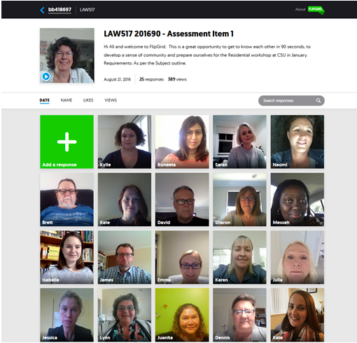
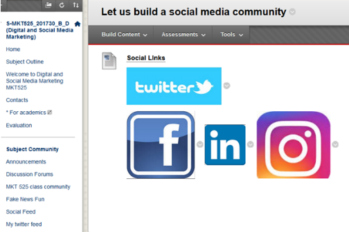

---

layout: strategy
title: "Using Media for Conversations"
category: strategy
tags: [Interaction Between Students, ]
description: "Take advantage of new technologies to enable rich conversations with students"
subjects: "LAW517, MKT525, "
subjectnames: "Mediation Processes and Uses, Digital Marketing, "

---

### Overview

Recent technologies and ongoing improvements to Internet speeds and connections mean that online conversation spaces can utilise rich media. These can take place synchronously using video but there are also a range of tools that allow asynchronous conversations too.

### Engagement

Rich media allows students to capture more nuance, tone and personality of the contributor than text and provide a more personalised mode of interacting. Once students have successfully set up to use the technology, they are then able to use the media in communicating with fellow students in engaging ways. Being clear about purpose and the nature of expected conversations will support students with this.

### In Practice

#### Subject

LAW517 Mediation Processes and Uses

#### Teaching Staff

Keryn Foley

#### Motivation

The students in this subject had a compulsory three day residential workshop at the end of session, and the teaching staff felt the students spent all of day one getting to know their peers and feeling comfortable with each other. The teaching staff were looking for ways to help students connect before the workshop, so they could dive straight into the subject content at the workshop.

#### Implementation

Students were required to introduce themselves, by creating a 90 second video using the tool Flipgrid. This provided students the opportunity to see and hear each other prior to the workshop. Judging by the number of view rates, the students all watched each others videos at least once prior to the residential workshop. By creating their own video using FlipGrid and then watching other students videos, it made it easier for students to develop connections and put names to faces before the workshop started. Teaching staff have used this tool for two offerings now, and all agree it has helped the students "get to know each other" before they meet in person during the workshop. This was a requirement of Assessment Item 1 and was given a 10% weighting.

{: .u-full-width}

#### Subject

MKT525 Digital Marketing

#### Teaching Staff

Michael Mehmet

#### Motivation

Student engagement is higher on Facebook than using i2, and given the nature of the subject, Digital Marketing, Facebook is a valid teaching and marketing tool. This Facebook page continue to be used after session to develop student knowledge and connect with each other and new students well after the subject has finished. It creates opportunities for collaboration and even future work partnership and funding sources.

#### Implementation

The teaching academic for MKT525 has set up a Facebook page specifically for the subject and students are invited to join the group with details provided on the i2 site. The academic regularly shares content with students but more importantly, this page also acts as a connection tool to Industry, sharing interviews and news from visit.

{: .u-full-width}

### Guide

This student-to-student strategy requires, initially, very clear direction and support to set up from teaching staff. It is important to remember that conversations across different media will need some monitoring and teacher presence. Depending on the focus of the task conversations may be led by the teacher, or by students or a combination of both.

### Tools

Selecting media tools that are well supported on mobile devices is essential. The ease of access afforded by mobile devices means your students can benefit from conversations across cohorts and even across year groups, whereby student mentoring and links to Industry/ Professional Practice may occur.

Going beyond social media, you might consider cloud based systems such as VoiceThread (audio, text and video) or SoundCloud (audio only) media conversations.

When selecting social media tools for subject specific conversations, be mindful about the nature of the content distributed through media platforms, ensuring core content is still distributed through CSU i2 sites.

Typical tools used include:

- [FlipGrid](http://www.flipgrid.com)
- [Facebook](http://www.facebook.com)
- [VoiceThread](http://www.VoiceThread.com)
- [Twitter](http://www.twitter.com)
- [SoundCloud](http://www.soundcloud.com)
- [Instagram](http://www.instagram.com)
- [LinkedIn](http://http://www.linkedin.com)
